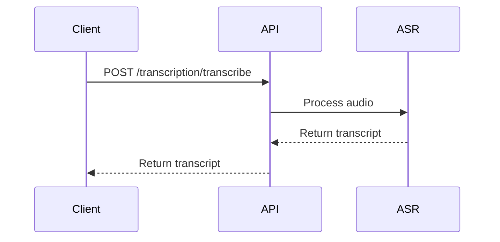
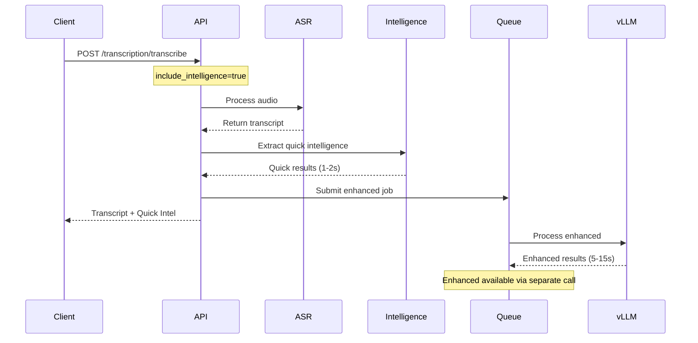
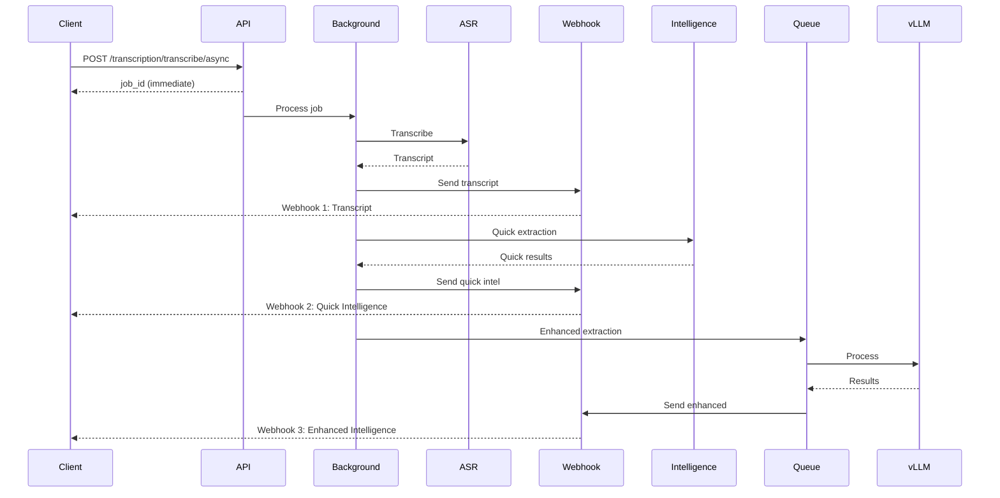
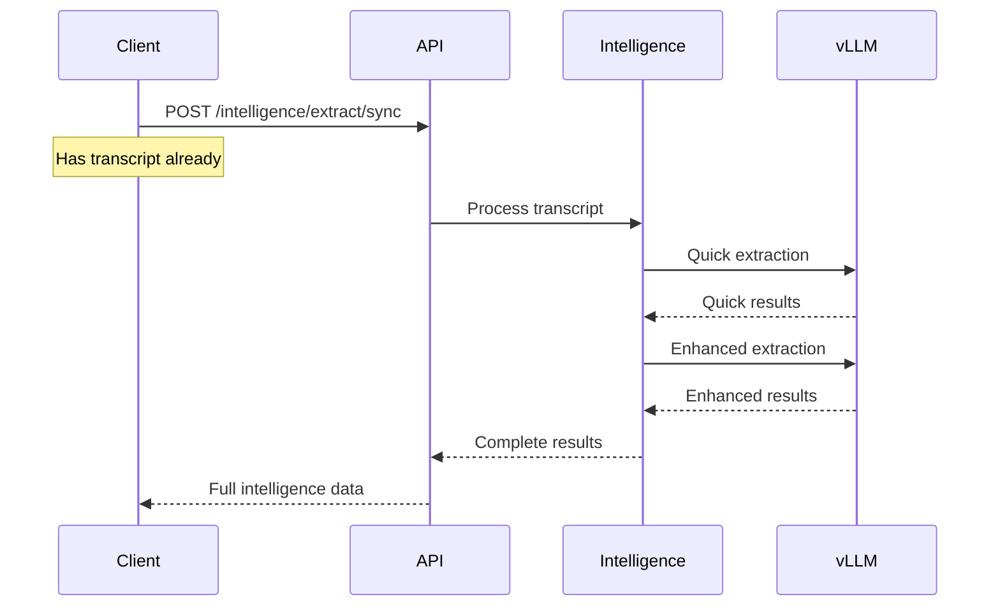

# S2A Complete Endpoint Architecture & Integration Workflows

## 🏗️ System Architecture Overview

```
┌─────────────────────────────────────────────────────────────────┐
│                         CLIENT APPLICATION                        │
│                    (Web, Mobile, SDK, CLI)                       │
└────────────────────┬───────────────────────────────────────────┘
                      │ HTTPS
                      ▼
┌─────────────────────────────────────────────────────────────────┐
│                    FASTAPI GATEWAY (Port 8001)                   │
│                         /v1/* endpoints                          │
├───────────────┬─────────────────┬─────────────────┬────────────┤
│  Transcribe   │   Intelligence   │     Stats       │   Auth     │
│   Router      │     Router       │    Router       │ Middleware │
└───────┬───────┴────────┬────────┴────────┬────────┴────────────┘
        │                │                  │
        ▼                ▼                  ▼
┌───────────────┐ ┌──────────────┐ ┌──────────────┐
│  ASR Service  │ │  Intelligence │ │  Monitoring  │
│   (NeMo)      │ │   Service     │ │   Service    │
│  GPU: 40%     │ │  (vLLM/LLM)   │ │ (Prometheus) │
└───────────────┘ │  GPU: 50%     │ └──────────────┘
                  └──────────────┘
```

## 📍 Complete Endpoint Map

### 1️⃣ **Transcription Endpoints** (`/v1/transcription/*`)

#### `/v1/transcription/transcribe` [POST]
**Purpose**: Synchronous transcription with optional intelligence
```python
Request:
  - audio_file: UploadFile (required)
  - enhance_audio: bool = True
  - remove_silence: bool = False
  - include_intelligence: bool = False  # NEW
  - intelligence_mode: str = "auto_detect"  # NEW

Response:
{
  "job_id": "uuid",
  "status": "completed",
  "text": "Full transcript...",
  "duration": 120.5,
  "rtf": 0.05,
  "quick_intelligence": {  # If include_intelligence=true
    "summary": "Meeting discussed Q4 targets...",
    "intent": "sales_planning",
    "sentiment": "positive",
    "action_items": [...],
    "key_entities": ["John", "Acme Corp"],
    "processing_time": 1.2
  },
  "enhanced_intelligence_status": {  # Background processing
    "job_id": "intel-uuid",
    "status": "processing",
    "estimated_completion": "2024-01-15T10:30:45Z"
  }
}
```

**Workflow**:
```
1. Client uploads audio → API Gateway
2. Audio validation & preprocessing
3. ASR Service transcribes (GPU: 40%)
4. If include_intelligence=true:
   a. Quick intelligence extracted (1-2s)
   b. Enhanced intelligence job queued
5. Return transcript + quick intelligence
6. Enhanced intelligence processes in background
```

#### `/v1/transcription/transcribe/async` [POST]
**Purpose**: Asynchronous transcription with webhook delivery
```python
Request:
  - audio_file: UploadFile (required)
  - callback_url: str (required)
  - enhance_audio: bool = True
  - include_intelligence: bool = True  # NEW
  - intelligence_mode: str = "auto_detect"  # NEW
  - priority: int = 0

Response:
{
  "job_id": "uuid",
  "status": "accepted"
}
```

**Multi-Stage Webhook Workflow**:
```
1. Job submission → Return job_id immediately
2. Background processing starts
3. Webhook 1 (immediate after transcription):
   {
     "job_id": "uuid",
     "status": "completed",
     "result": {
       "text": "Full transcript...",
       "duration": 120.5
     }
   }

4. Webhook 2 (1-2s later):
   {
     "job_id": "uuid",
     "intelligence_type": "quick",
     "intelligence_data": {
       "summary": "...",
       "action_items": [...]
     }
   }

5. Webhook 3 (5-15s later):
   {
     "job_id": "uuid",
     "intelligence_type": "enhanced",
     "intelligence_data": {
       // 50+ fields of comprehensive data
     }
   }
```

#### `/v1/transcription/status/{job_id}` [GET]
**Purpose**: Check async job status
```python
Response:
{
  "job_id": "uuid",
  "status": "processing|completed|failed",
  "result": {...}  // If completed
}
```

#### `/v1/transcription/jobs/{job_id}` [DELETE]
**Purpose**: Cancel pending/processing job
```python
Response:
{
  "message": "Job cancelled"
}
```

### 2️⃣ **Intelligence Endpoints** (`/v1/intelligence/*`)

#### `/v1/intelligence/extract` [POST]
**Purpose**: Submit transcript for async intelligence extraction
```python
Request:
{
  "transcript_id": "test_123",
  "transcript_text": "Meeting transcript...",
  "mode": "auto_detect|sales|support|general",
  "priority": "normal|high|low"
}

Response:
{
  "job_id": "intel-uuid",
  "transcript_id": "test_123",
  "status": "submitted",
  "message": "Intelligence extraction job submitted"
}
```

#### `/v1/intelligence/extract/sync` [POST]
**Purpose**: Synchronous intelligence extraction (waits for result)
```python
Request:
{
  "transcript_id": "test_123",
  "transcript_text": "Meeting transcript...",
  "mode": "sales"
}

Response (after 5-15s):
{
  "job_id": "intel-uuid",
  "transcript_id": "test_123",
  "status": "completed",
  "mode": "sales",
  "processing_time": 8.5,
  "intelligence": {
    "call_type": "sales_call",
    "intent": "product_demo",
    "sentiment": "positive",
    "summary": "...",
    "people": [...],
    "companies": [...],
    "products": [...],
    "action_items": [...],
    "financial_info": {...},
    "opportunity_info": {...},
    // 40+ more fields
  },
  "conversation_stats": {
    "total_speakers": 3,
    "question_count": 15,
    // ...
  }
}
```

#### `/v1/intelligence/job/{job_id}/status` [GET]
**Purpose**: Check intelligence job status
```python
Response:
{
  "job_id": "intel-uuid",
  "transcript_id": "test_123",
  "status": "queued|processing|completed|failed",
  "mode": "sales",
  "progress": 0.75,
  "estimated_completion": "2024-01-15T10:30:45Z"
}
```

#### `/v1/intelligence/job/{job_id}/result` [GET]
**Purpose**: Get completed intelligence results
```python
Response:
{
  "job_id": "intel-uuid",
  "transcript_id": "test_123",
  "status": "completed",
  "intelligence": {...},  // Full extraction
  "conversation_stats": {...}
}
```

#### `/v1/intelligence/metrics` [GET]
**Purpose**: Service metrics and health
```python
Response:
{
  "service_metrics": {
    "jobs_processed": 1523,
    "average_processing_time": 7.2,
    "queue_depth": 5
  },
  "queue_status": {
    "pending": 3,
    "processing": 2
  },
  "health": {
    "status": "healthy",
    "vllm_status": "ready"
  }
}
```

#### `/v1/intelligence/modes` [GET]
**Purpose**: Available extraction modes
```python
Response:
{
  "modes": {
    "auto_detect": {...},
    "sales": {...},
    "support": {...},
    "general": {...}
  },
  "capabilities": [...]
}
```

### 3️⃣ **Statistics Endpoints** (`/v1/statistics/*`)

#### `/v1/statistics/health` [GET]
**Purpose**: System health check (no auth required)
```python
Response:
{
  "status": "healthy",
  "asr_service": "ready",
  "intelligence_service": "ready",
  "gpu_available": true,
  "uptime": 3600
}
```

#### `/v1/statistics/stats` [GET]
**Purpose**: Detailed service statistics
```python
Response:
{
  "transcriptions": {
    "total": 5234,
    "today": 123,
    "average_duration": 45.2,
    "average_rtf": 0.05
  },
  "intelligence": {
    "extractions": 3421,
    "average_time": 7.5,
    "mode_distribution": {
      "sales": 45,
      "support": 30,
      "general": 25
    }
  },
  "system": {
    "cpu_usage": 23.5,
    "memory_usage": 45.2,
    "gpu_usage": 67.8,
    "gpu_memory": {
      "asr": 40,
      "vllm": 50
    }
  }
}
```

## 🔄 Integration Workflows

### Workflow 1: Simple Transcription (No Intelligence)



### Workflow 2: Transcription + Intelligence (Sync)



### Workflow 3: Async with Progressive Webhooks



### Workflow 4: Direct Intelligence Extraction



## 🔗 How Endpoints Connect

### 1. **Transcription → Intelligence Bridge**

```python
# In transcribe endpoint
if include_intelligence:
    # Automatically trigger intelligence
    intelligence_result = await process_transcript_intelligence(
        job_id=job_id,
        transcript=result.text,
        callback_url=callback_url
    )
```

### 2. **Intelligence Service Integration**

```python
# services/intelligence_integration.py
async def process_transcript_intelligence():
    # Stage 1: Quick (1-2s)
    quick = extract_quick(transcript)  # Simple LLM call
    send_webhook(quick)

    # Stage 2: Enhanced (5-15s)
    job = submit_to_queue(transcript)  # Complex extraction
    monitor_and_send_webhook(job)
```

### 3. **vLLM Server Processing**

```python
# Two different prompts for two stages
quick_prompt = "Extract summary and top 3 actions"  # 500 tokens
enhanced_prompt = "Extract all business intelligence"  # 4000 tokens

# vLLM handles both with different priorities
HIGH_PRIORITY → Quick intelligence
NORMAL_PRIORITY → Enhanced intelligence
```

## 🎯 Key Integration Points

### 1. **Shared Services**
- ASR Service (40% GPU)
- vLLM Service (50% GPU)
- Audio Processor
- Batch Processor
- Webhook Sender

### 2. **Data Flow**
```
Audio → Transcription → Text → Intelligence → Structured Data
                           ↓
                      Webhook Delivery
```

### 3. **Authentication Flow**
All endpoints (except `/health`) require Bearer token:
```
Request Header: Authorization: Bearer bp-proj-xxx
→ Auth Middleware validates
→ Rate limiting applied
→ Usage tracked
→ Endpoint processes request
```

### 4. **Error Handling Chain**
```
Client Request
  ↓
Validation Layer (400 errors)
  ↓
Authentication (401 errors)
  ↓
Rate Limiting (429 errors)
  ↓
Processing (500 errors)
  ↓
Response/Webhook
```

## 📊 Intelligence Mode Detection

When `mode="auto_detect"`, the system analyzes transcript for:

```python
if "customer" in transcript and "issue" in transcript:
    mode = "support"
elif "price" in transcript or "deal" in transcript:
    mode = "sales"
else:
    mode = "general"
```

## 🔄 Webhook Retry Logic

```python
# Webhooks are sent with exponential backoff
Attempt 1: Immediate
Attempt 2: +1 second
Attempt 3: +2 seconds
Attempt 4: +4 seconds
Max attempts: 5
```

## 🚀 Performance Characteristics

| Operation | Time | GPU Usage | Memory |
|-----------|------|-----------|---------|
| Transcription (1 min audio) | 3-5s | 40% | 2GB |
| Quick Intelligence | 1-2s | 10% | 1GB |
| Enhanced Intelligence | 5-15s | 50% | 4GB |
| Concurrent Capacity | - | - | ~10 jobs |

## 🔑 Critical Design Decisions

1. **Progressive Enhancement**: Users get immediate value, then richer data
2. **Non-blocking**: Intelligence never blocks transcription
3. **Fault Isolation**: Intelligence failures don't break transcription
4. **GPU Sharing**: Careful memory allocation (40/50 split)
5. **Webhook Stages**: Multiple deliveries for better UX
6. **Mode Detection**: Automatic context understanding

This architecture ensures smooth data flow from audio input through transcription to comprehensive business intelligence extraction, with multiple integration points for flexibility and reliability.